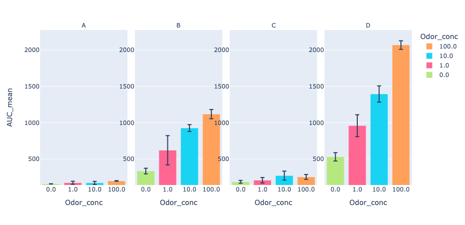
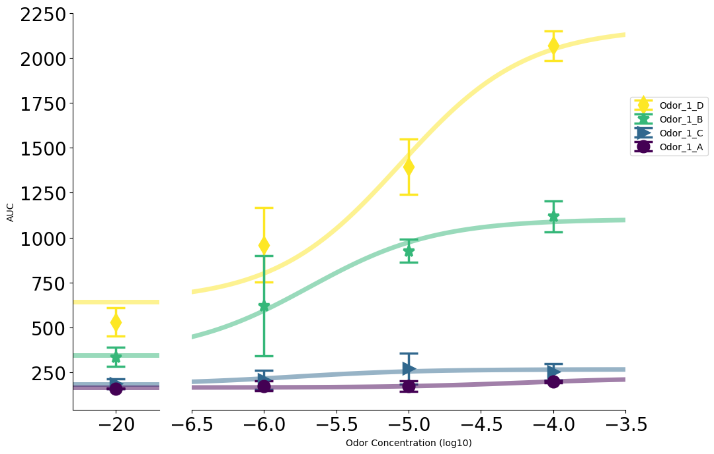

markdown
# Glosensor Pipeline

This pipeline is designed for processing platereader CSV files, specifically for Glosensor data. It reads in files from a plate reader, consolidates the data based on user labeling, normalizes data, plots data values, and generates sigmoid dose curves.

## Table of Contents

- [Installation](#installation)
- [Usage](#usage)
- [Example](#example)
- [Contributing](#contributing)
  
## Installation

To use this pipeline, you need to have Python installed along with the necessary dependencies. You can create a conda environment and install the required packages using the following command:


```bash
conda create --name glosensor --file requirements.txt
```

After installation if nbformat error exists. 
```bash
pip install --upgrade nbformat
```

## Usage

 1. **Initialize the GlosensorData class**:
    ```python
    glo = GlosensorData(path)
    glo.ReadTableData()
    ```

 2. **Visualize the 96-well plate data**:
    ```python
    fig_list = glo.view_96well_curve(x_by='Time', y_by='value', facet_col_by='Column', facet_row_by='Row',
                                     facet_col_spacing=0, facet_row_spacing=0, n_facet_col_wrap=12)
    for fig in fig_list:
        fig.show()
    ```

 3. **Label your 96-well plate based on the transfected schema**:
    ```python
    glo.data.loc[(glo.data.Column.isin([1, 2, 3, 4])), 'Odor'] = 'Odor_1'
    glo.data.loc[(glo.data.Column.isin([5, 6, 7, 8, 9, 10, 11, 12])), 'Odor'] = 'Odor2'

    glo.data.loc[(glo.data.Column.isin([1])), 'Group'] = 'A'
    glo.data.loc[(glo.data.Column.isin([2])), 'Group'] = 'B'
    glo.data.loc[(glo.data.Column.isin([3])), 'Group'] = 'C'
    glo.data.loc[(glo.data.Column.isin([4])), 'Group'] = 'D'

    glo.data.loc[(glo.data.Row.isin(['A', 'B'])), 'Odor_conc'] = 100
    glo.data.loc[(glo.data.Row.isin(['C', 'D'])), 'Odor_conc'] = 10
    glo.data.loc[(glo.data.Row.isin(['E', 'F'])), 'Odor_conc'] = 1
    glo.data.loc[(glo.data.Row.isin(['G', 'H'])), 'Odor_conc'] = 0

    glo.data = glo.data.dropna()
    ```

 4. **Process and plot data**:
    - **Get melted, AUC, and slope data**:
        ```python
        melted_data, AUC_data, slope_data = glo.get_melted_AUC_slope_data(
            group_col=['Odor', 'Group', 'Odor_conc'],
            slope_AUC_time=[0, 3],
            data=glo.data
        )
        ```
        
    - **Plot facet plots for AUC**:
        ```python
        plot_data = AUC_data[['Odor_conc', 'Group', 'AUC_mean', 'AUC_std', 'Plate']]
        plot_data = plot_data[plot_data.Plate.isin([1, 2])]
        plot_data = plot_data.sort_values('Group')
        plot_data = plot_data.drop('Plate', axis=1)
        plot_data = plot_data.drop_duplicates().reset_index(drop=True)

        plot_data['Group'] = pd.Categorical(plot_data['Group'], categories=list(glo.data.Group.unique()), ordered=True)
        plot_data = plot_data.sort_values(['Group', 'Odor_conc'], ascending=[True, False])
        plot_data['Odor_conc'] = plot_data['Odor_conc'].astype(str)

        fig = glo.plot_facet_bar(plot_data,
                                 x_by="Odor_conc",
                                 y_by="AUC_mean",
                                 facet_col_by='Group',
                                 error_y_by='AUC_std',
                                 n_facet_col_wrap=4)
        fig.show()
        ```
        
    - **Plot dose curves**:
        ```python
        group_col = ['Odor', 'Group']

        custom_color = [value for key, value in distinct_colors((['x'] * len(AUC_data.Group.unique())), category='pastel').items()]

        plot_data = AUC_data

        fig, stat = glo.plot_Dose_curves(plot_data.sort_values('AUC', ascending=False),
                                         groupby_col=group_col,
                                         figsize=(10, 7),
                                         log_conc_offset=-6,
                                         x_by='Odor_conc',
                                         point_size=12,
                                         std_capsize=10,
                                         std_linewidth=2.5,
                                         curve_width=5)
        fig.show()
        print(pd.DataFrame(stat).T)
        ```
        
      
## Example

For more detailed examples follow Glosensor_demo.ipynb notebook

## Contributing

Contributions are welcome! Please feel free to submit a Pull Request.


